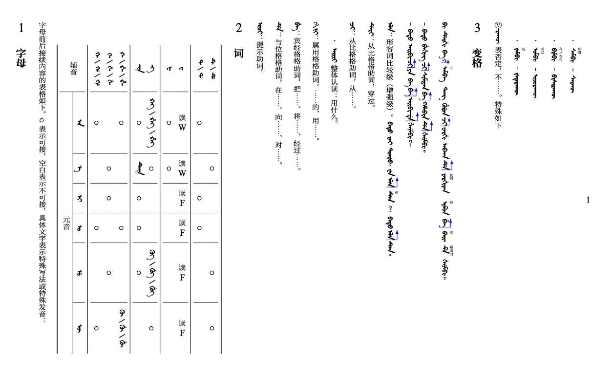
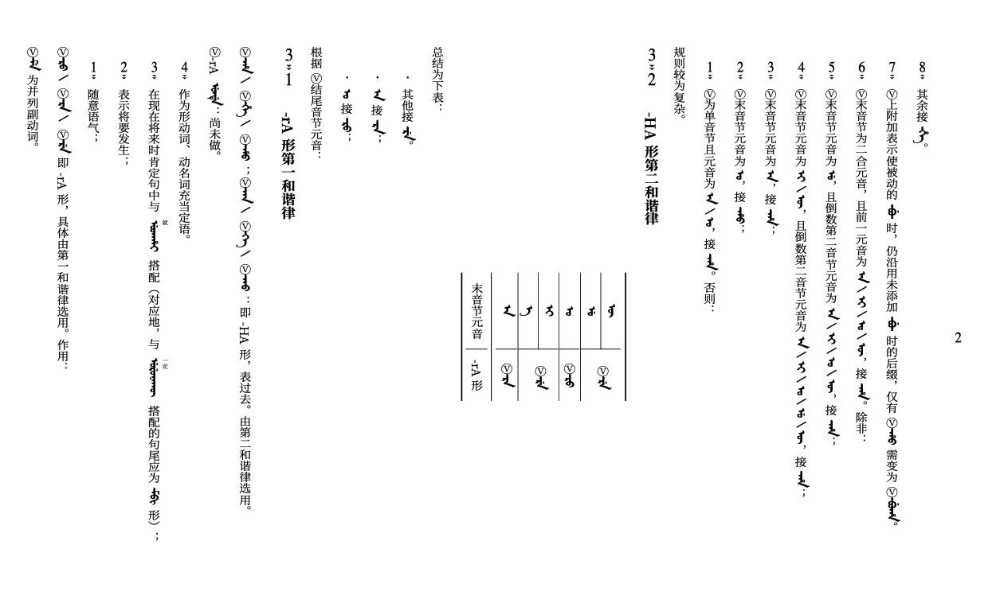
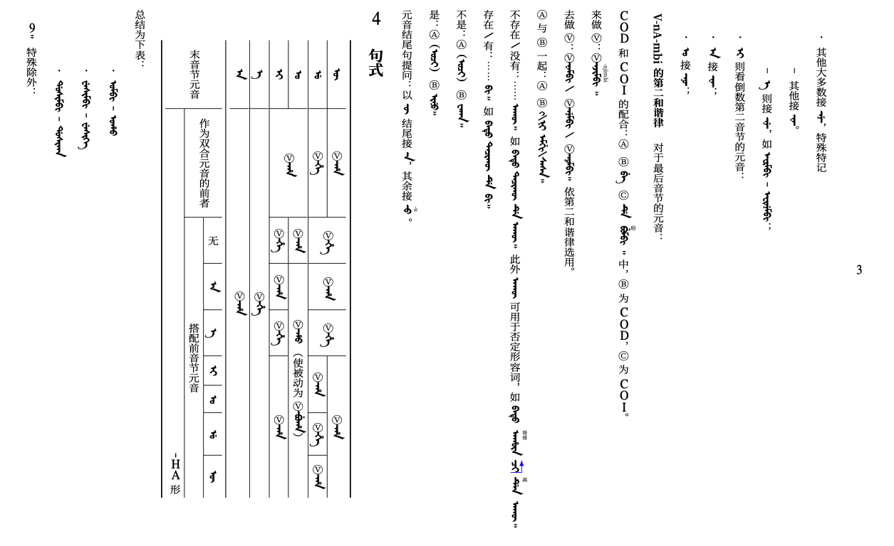
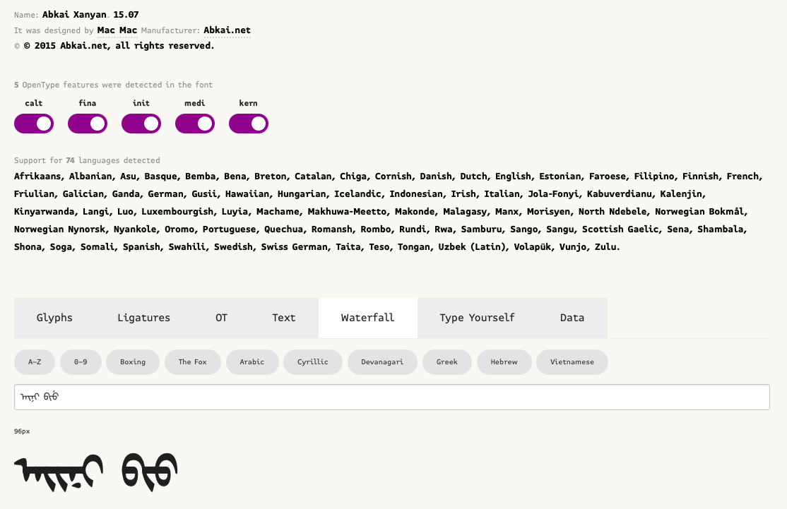
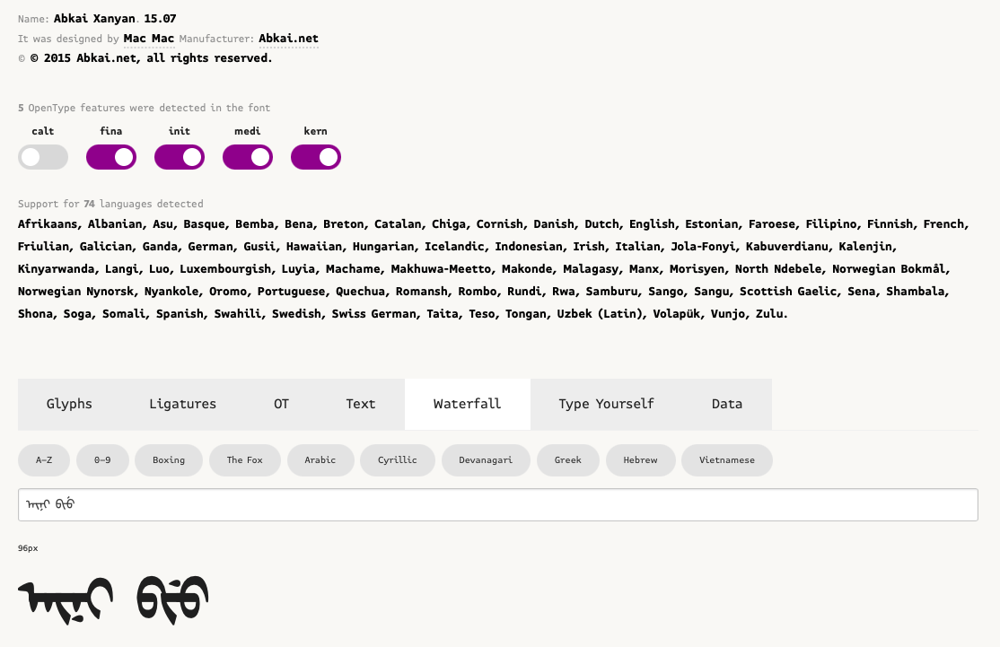

# LaTeX排版满文笔记的尝试：一、思路

最近在学习满文的过程中遇到一些排版的问题。简单调查了一下，发现在这方面的轮子都有些旧了，因此整理了一下比较可行的方法。学得不多，排版上也是碰到什么问题就先解决什么问题，一点一点找补。

这是其中的第一篇，聊聊整体的实现思路。

话不多说，来看看目前实现的效果：

## 满文版式特点概述

满文是一种字母文字，字母在单词首、单词中、单词尾及独立成词时均有不同形态。视觉上，同一单词内字母连成一串。满文笔记中，往往会出现半个单词甚至半个音节的情况，这需要我们手动调整字母形态。

满文的行文方向为自上至下阅读、自左至右折行。这种折行方向与汉语（向左折行）是相反的。学习笔记不可避免地混排汉满双文，因此需要能够以最简单的方式切换折行方向。

满文借用蒙古文字母拼写，因此其所采用字母来自Unicode中的Mongolian区块，编码范围为U+1800～U+18AF。目前支持该区块字符的字体不约而同地将字母逆时针旋转90度，使得单词可以从左至右拼写。

满文有多种转写方案，不同的转写方案间接带来了不同的拼写规则，如对于元音字母之后的᠊ᠣ，一些转写方案认为这是将字母 ᡠ 的词尾形 ᠊ᡠ 中的点省略了，应按 ᡠ 转写为u，而另一些转写方案则认为这可以直接按字母 ᠣ 转写为o。

## LaTeX排版思路

### 转写方案和字体的选用

我学习满文时使用的是太清转写，因此希望在源代码中可以直接使用太清转写，而不必考虑字母层面的拼写规则。例如，理想情况情况下，源代码`aini`可以直接渲染为 ᠠ᠊ᡳ᠊ᡳ᠊ᠨᡳ 而不是 ᠠ᠊ᡳ᠊ᠨᡳ，不需要我单独照顾拼写规则而故意拼作`aiini`；源代码`biu`可以直接渲染为 ᠪᡳ᠊ᠣ 而不是 ᠪᡳ᠊ᡠ ，不需要我故意拼作`bio`。

我们选用了与太清拼写规则自洽的太清字体（Abkai Xanyan 15.07）作为排版字体。其优势是，通过OpenType的上下文替换（contextual alternates, "calt"）特性，上述问题可以在字体层面解决。我们可以在[fontdrop!](https://fontdrop.info)网站验证该特性。上传该字体后可以看到，当calt特性开启时，最下方的字体预览可以正确显示 ᠠ᠊ᡳ᠊ᡳ᠊ᠨᡳ 和 ᠪᡳ᠊ᠣ，而输入框中的系统默认字体则不能做到这一点：

再来反向验证一下。手动将calt特性关闭后，则显示为不符合拼写规则的 ᠠ᠊ᡳ᠊ᠨᡳ 和 ᠪᡳ᠊ᡠ：

太清转写和太清字体的介绍见[太清网](https://abkai.net/)。但不知为何，网站上的字体下载链接失效了，可以自己找资源。

### 排版工具的选用

在满、蒙文的LaTeX排版上，已有比较成熟的工具[MonTeX](https://www.ctan.org/pkg/montex)，功能繁多且支持面广，但采用的转写规则不同。感兴趣的朋友可以自行探索。

我们直接采用XeLaTeX作为排版工具。XeLaTeX是TeX语言的一个实现，其优势是可以直接使用系统中安装的字体作为排版字体，并且能够很好地支持字体内部的各种特性。

### 如何实现竖排和向右折行

这个地方其实卡了挺久的……好在最终解决了。

最终的解决方案如下。

1. 前文提到过，满文字体都将字母逆时针旋转了90度，也就是说，字母实际上是“趴着的”。这就需要我们在输出文档时将页面顺时针旋转90度，将字母立起来。
2. 对应地，对于混排的汉字和汉语标点符号，我们可以调用专门用于竖排的vert特性。注意，调用这个特性不同于暴力地将文字旋转90度，特性中尤其对标点符号做了调整，如将引号改为适应竖排的形式。
3. 旋转后，向下折行的文本会变成向左折行。为此，我们可以调用一条挺冷门的指令`\XeTeXupwardsmode1`，它的作用是让文本向上折行。这样，旋转后，文本就可以向右折行了。

这种方案参考了以下链接：

- 如何使用 LaTeX 输出竖版排版的文章或书籍？ - 宋景和的回答 - 知乎 https://www.zhihu.com/question/20544732/answer/376414732

- 如何使用 LaTeX 输出竖版排版的文章或书籍？ - Nyoeghau的回答 - 知乎 https://www.zhihu.com/question/20544732/answer/581301432
- https://tex.stackexchange.com/questions/87259/manchu-and-mongolian-script/140972#140972

