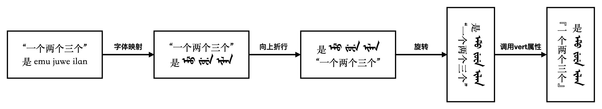
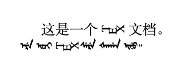
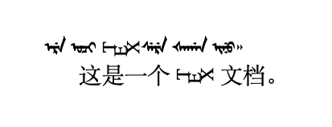
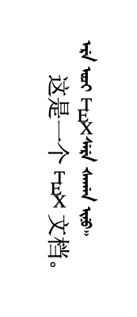
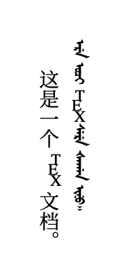
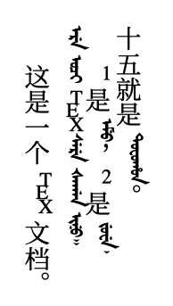
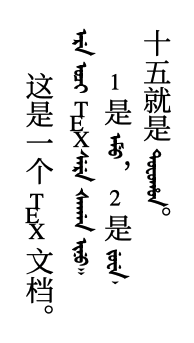
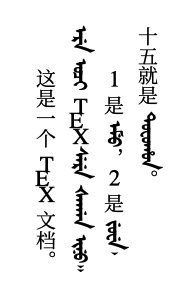
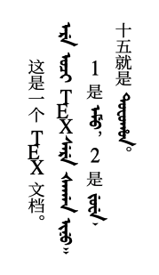

# LaTeX排版满文笔记的尝试：二、基本实现

这是尝试用LaTeX排版满文笔记的第二篇文章，我们来动手实现上文提到的效果。

这篇文章假定你能看懂如下代码段，并且知道如何借助XeLaTeX将其编译为PDF文件：

```tex
\documentclass{article}
\usepackage{xeCJK}

\begin{document}
这是一个\TeX 文档。\\
ere oqi \TeX sere qagan inu.
\end{document}
```

## 实现过程

接下来的实现过程遵从以下步骤：




### 字体映射

XeLaTeX定义文档的主字体和CJK主字体时，可以在选项中通过参数`Mapping`指定映射文件，从而调用定义字体映射。我们首先编写映射文件。

以6个元音字母为例。在同路径下新建文件abkai-to-manju.map，内容如下：

```
LHSName "abkai-to-manju"
RHSName "UNICODE"

pass(Unicode)

; 字母表转写
U+0061 <> U+1820 ; a
U+0065 <> U+185D ; e
U+0069 <> U+1873 ; i
U+006F <> U+1823 ; o
U+0075 <> U+1860 ; u
U+0076 <> U+1861 ; v
```

分号`;`后内容为注释，`<>`两侧表示映射前后符号的Unicode。例如，`U+0061 <> U+1820`表示将字符`a`映射为`ᠠ`。

map文件支持将多个字符作为一个整体映射，例如将`k'`映射为`ᠺ`可以写作`U+0067 U+0027 <> U+186C`。

如此列出全部所需满文字母的映射关系后，**需要在目录下运行如下指令**，得到文件abkai-to-manju.tec：

```
teckit_compile abkai-to-manju.map
```

此时即可在.tex文件中以如下方式指定主字体的映射关系：

```tex
\setmainfont[
    Mapping = abkai-to-manju]
    {AbkaiXanyan}
```

`Mapping`选项支持指定路径，例如对于abkai-to-manju.map和abkai-to-manju.tec位于tex文件父目录的情况，可以指定`Mapping = ../abkai-to-manju`。

正确完成字体映射后，效果如下：

```tex
\documentclass{article}
\usepackage{xeCJK}

\setmainfont[
    Mapping = abkai-to-manju]
    {AbkaiXanyan}

\begin{document}
这是一个\TeX 文档。\\
ere oqi \TeX sere qagan inu.
\end{document}
```



> 勘误：图片中ᡧᠠᡤᠠᠨ 应改为ᠴᠠᡤᠠᠨ，下同。

太清字体默认将字母旋转90度书写，因此TeX字样横卧。

目前的abkai-to-manju.map文件见本文附录小节。目前的文件还不完整，随时遇到新的问题随时更新。

- 满文字母表参考：https://abkai.net/zh/manchu/manchu-transliteration/

- 查询Unicode区块和个别字符的Unicode：https://symbl.cc/en/

- 批量查询多个字符的Unicode：https://r12a.github.io/app-conversion/

### 向上折行、旋转

如下指令可以让文档的折行方式由向下折行变为向上折行：

```tex
\XeTeXupwardsmode1
```

在tex文件中插入该指令后，效果如下（由于我们更改了文本行的堆叠方式，所以内容出现在页面底部，带有缩进的内容为程序认为的“首行”）：



atbegshi包中的如下指令可以使得文档旋转90度后输出：

```tex
\AtBeginShipout{%
    \global\setbox\AtBeginShipoutBox\vbox{%
        \special{pdf: put @thispage <</Rotate 90>>}%
        \box\AtBeginShipoutBox
    }%
}%
```



### 调用vert属性

我们可以在设置CJK主字体时通过`RawFeature={vertical:+vert}`项直接调用字体文件的vert特性。这里指定中文字体为思源宋体（我使用的是谷歌发布的版本，因此名称为Noto而不是Source Han）：

```tex
\setCJKmainfont[
    RawFeature={vertical:+vert}]
    {NotoSerifCJKsc-Regular}
```



至此，汉满文混排的基本逻辑已经实现，但有一些美观度上的问题亟待我们解决。接下来，针对这些问题做出一些细节调整。

## 微调

我们以如下文档内容为例，来展示微调操作：

```tex
\begin{document}
这是一个\TeX 文档。\\
ere oqi \TeX sere qagan inu. 

1是emu，2是juwe,\\十五就是tofohon。
\end{document}
```



在调整前，可以看到整体上的排布比较杂乱，阅读体验不佳。这里主要梳理了几个突出问题：

- 字符位置有些交错，一行文字排列不整齐；
- 汉字偏大，整体突兀；
- 汉字的阅读速度大于满文的阅读速度，阅读节奏不佳。

接下来针对这些问题来给出解决方案。

### 中线偏移

目前的混排方案中，CJK字符与非CJK字符的中线有些偏移，这在二者交替出现时尤其明显。这里可以通过`\raise`指令来将汉字向“上”适当抬升，在输出时体现为所有汉字向右偏移：

```tex
\newcommand*\CJKmovesymbol[1]{\raise.45em\hbox{#1}}
\newcommand*\CJKmove{\punctstyle{plain}
    \let\CJKsymbol\CJKmovesymbol
    \let\CJKpunctsymbol\CJKsymbol}
    \AtBeginDocument{\CJKmove}
```



这里采用的方法来自https://www.zhihu.com/question/20544732/answer/581301432。

### 缩小汉字字号

由于汉字和满文是分开指定字体的，所以通过在指定CJK主字体时设定`Scale`选项，即可很方便地将汉字字号缩小。经过反复实验，比例设定为0.7时阅读起来比较愉快：

```tex
\setCJKmainfont[
    RawFeature={vertical:+vert}, 
    Scale=0.7]
    {NotoSerifCJKsc-Regular}
```



### 汉字的压缩和满文的伸展

作为满语初学者，我的汉字阅读速度很快，只需要扫一眼就知道内容，满文却需要一点一点拼读。这样带来的问题是，在汉字和满文交错出现的时候，阅读的目光就像晚高峰堵车一样一拱一拱地前进——也就是前面提到的“阅读节奏不佳”。

通过在指定字体时设置选项`FakeStretch`的值，可以强行将字体在行文方向上适当拉伸或压缩。这里将满文的`FakeStretch`设置为1.1倍，汉字设置为0.95倍，从而让满文更瘦长，汉字更扁宽，在一定程度上让阅读节奏平缓下来：

```tex
\setmainfont[
    Mapping = abkai-to-manju,
    FakeStretch=1.1]
    {AbkaiXanyan}

\setCJKmainfont[
    RawFeature={vertical:+vert}, 
    Scale=0.7,
    FakeStretch=0.95]
    {NotoSerifCJKsc-Regular}
```



注意，这里的伸缩操作是由排版引擎机械进行的，并非字体的适配特性，因此伸缩比例不宜太夸张，否则会破坏文字笔画的协调性。

---

至此，我们实现了汉字和满文的混排，并且解决了其中的明显问题。下一篇文章中，我们针对满文学习笔记进行一些个性化的定制

## 附录：本文使用的完整文件

### abkai-to-manju.map

```
; 生效指令：teckit_compile abkai-to-manju.map
; Unicode转换网址：https://r12a.github.io/app-conversion/

LHSName "abkai-to-manju"
RHSName "UNICODE"

pass(Unicode)

; 字母表转写
U+0061 <> U+1820 ; a
U+0065 <> U+185D ; e
U+0069 <> U+1873 ; i
U+006F <> U+1823 ; o
U+0075 <> U+1860 ; u
U+0076 <> U+1861 ; v

; n强制显示点，用于en
U+006E U+0027 <> U+1828 U+180B ; en'

U+006E <> U+1828 ; n
U+0073 <> U+1830 ; s
U+0078 <> U+1867 ; x
U+006C <> U+182F ; l
U+006D <> U+182E ; m
U+0071 <> U+1834 ; q
U+006A <> U+1835 ; j
U+0079 <> U+1836 ; y
U+0072 <> U+1875 ; r

U+0066 <> U+1876 ; f
U+0077 <> U+1838 ; w
U+0063 <> U+186E ; c
U+007A <> U+186F ; z
U+0072 U+0027 <> U+1870 ; r'

U+0063 U+0079 U+0027 <> U+186E U+185F ; cy'
U+007A U+0079 U+0027 <> U+186F U+1873 ; zy'
U+0073 U+0079 U+0027 <> U+1830 U+185F ; sy'
U+0071 U+0079 U+0027 <> U+1871 U+1873 ; qy'
U+006A U+0079 U+0027 <> U+1877 U+1873 ; jy'

U+0074 <> U+1868 ; t
U+0064 <> U+1869 ; d

; 强制显示出头形式
U+0074 U+0027 U+0027 <> U+1868 U+180B ; t''
U+0064 U+0027 U+0027 <> U+1869 U+180B ; d''

U+0064 U+0076 <> U+1868 U+1861 ; dv

U+0062 <> U+182A ; b
U+0070 <> U+1866 ; p

; 默认展示阳性
U+0067 <> U+1864 ; k
U+006B <> U+1874 ; g
U+0068 <> U+1865 ; h

; 强制显示阴性
U+0067 U+0027 U+0027 <> U+1864 U+180B ; k''
U+006B U+0027 U+0027 <> U+1874 U+180B ; g''
U+0068 U+0027 U+0027 <> U+1865 U+180B ; h''

U+0067 U+0027 <> U+186C ; k'
U+006B U+0027 <> U+183A ; g'
U+0068 U+0027 <> U+186D ; h'

U+006B U+0027 U+0076 <> U+1874 U+180B U+1861 ; k'v
U+0067 U+0027 U+0076 <> U+1864 U+180B U+1861 ; g'v
U+0068 U+0027 U+0076 <> U+1865 U+180B U+1861 ; h'v

U+006E U+0067 <> U+1829 ; ng

; 小-i
U+002D U+0069 <> U+202F U+1873 ; -i

; 标点
U+002C <> U+1808 ; ,
U+002E <> U+1809 ; .

; 字干
U+003D <> U+180A U+180A; =

; 字牙
U+0027 <> U+1807 ; '
```

### main.tex

```tex
\documentclass{article}
\usepackage{xeCJK}
\usepackage{atbegshi}

\setmainfont[
    Mapping = abkai-to-manju,
    FakeStretch=1.1]
    {AbkaiXanyan}

\setCJKmainfont[
    RawFeature={vertical:+vert}, 
    Scale=0.7,
    FakeStretch=0.95]
    {NotoSerifCJKsc-Regular}

\newcommand*\CJKmovesymbol[1]{\raise.45em\hbox{#1}}
\newcommand*\CJKmove{\punctstyle{plain}
    \let\CJKsymbol\CJKmovesymbol
    \let\CJKpunctsymbol\CJKsymbol}
    \AtBeginDocument{\CJKmove}

\XeTeXupwardsmode1

\AtBeginShipout{%
    \global\setbox\AtBeginShipoutBox\vbox{%
        \special{pdf: put @thispage <</Rotate 90>>}%
        \box\AtBeginShipoutBox
    }%
}%

\begin{document}
这是一个\TeX 文档。\\
ere oqi \TeX sere qagan inu.

1是emu，2是juwe,\\十五就是tofohon。
\end{document}
```
