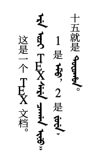
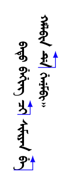
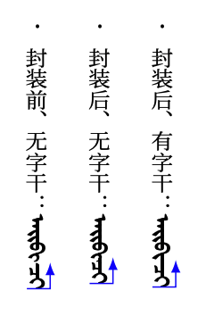
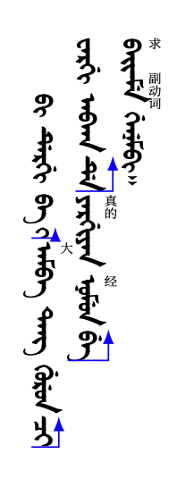
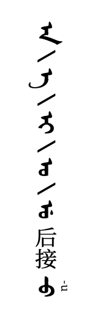

# LaTeX排版满文笔记的尝试：三、针对学习笔记的定制

这是尝试用LaTeX排版满文笔记的第三篇文章。在前文中，我们已经理顺了思路，实现了基本的汉满混排效果。目前，我们的笔记效果如下：



本文假定您已经阅读过并理解前两篇文章：

- 一、思路
- 二、基本实现

如果您还没有阅读，可能会在接下来的阅读过程中对细节感到困惑。

学习满文的过程中，实际还需要一些特殊的笔记效果。本文整理了这些个性化的内容，供大家参考。

## 向前的箭头

满语是黏着语，其中有很多词缀和格助词，在初学时往往需要我们特殊标注它们，帮助理解整句话的意思。

首先需要绘制箭头。这里是在ChatGPT给出的解决方案上微调实现的：

```tex
\usepackage[normalem]{ulem}  % Provides underline and strikeout commands
\usepackage{tikz}            % Required for drawing the arrow

%箭头绘制
\newcommand{\arrowuline}[1]{%
    \tikz[baseline=(char.base)]{
        \node[inner sep=0pt,outer sep=0pt] (char) {#1};
        \draw[blue,latex-] ([yshift=0.5ex]char.north west) -- ([yshift=0.5ex]char.north east) |- (char.south east);
    }%
}
```

该函数可以画出围绕其参数指向上方的箭头：

```tex
\begin{document}
batu beging \arrowuline{qi} simiyan \arrowuline{be} \\
halbin \arrowuline{de} genembi.
\end{document}
```



箭头会自动检测参数的宽度，并且画出匹配尺寸的箭头。注意，函数中采用诸如`char.north west`的形式来定位位置，这里的`north west`（西北方，即左上方）指的是文档页面旋转前的方向。旋转后，对应单词的右上方。

一些变格的后缀会采用连写的形式，因此前后宜减小字距，并在衔接处添加字干（᠊，U+180A）来衔接。这里我将`\arrowuline`又封装了一层（此处用“封装”似乎不太合适？），缩小其前后字距：

```tex
\newcommand{\aux}[1]{%
    \!\arrowuline{#1}\!%
}
```

其中`aux`代表auxiliary word。

考虑到字体中字干的设计过短，在abkai-to-manju.map文件中将字符`=`映射为两节字干以拉长空间，这样可以让箭头的起止位置看起来更加明确：

```
...上文省略

; 字干
U+003D <> U+180A U+180A; =

...下文省略
```

现在以单词ᠠ᠊ᡳ᠊ᡳ᠊ᠪᡳᠴᡳ为例，展示封装前后、添加字干前后的显示效果：

```tex
\begin{document}
\begin{itemize}
    \item 封装前、无字干：aibi\arrowuline{qi}
    \item 封装后、无字干：aibi\aux{qi}
    \item 封装后、有字干：aibi=\aux{=qi}
\end{itemize}
\end{document}
```



## 双语标注

对于语言学习笔记，双语标注是很重要的一环。这里的实现没有太多可说的，只需要叠加一层略微错位的字盒即可：

```tex
%双语展示
\newcommand{\bil}[2]{%
    \raisebox{0.8em}[0pt][0pt]{\makebox[0cm][l]{\tiny #2}}\mbox{#1}%
}
```

其中`bil`代表bilingual。由于双语标注往往用于整个单词，所以这里没有针对半个单词的情况做特殊优化。如果不可避免地需要标注半个单词，则与`\aux`的思路相同，需要注意字干的衔接和间距的控制。下例中，注意ᠪᠠ᠊ᡳ᠊ᡳᠮᡝ一词是如何拆分为两部分的：

```tex
\begin{document}
bi dergi ba \aux{-i} \bil{amba}{大} tang gurun \aux{qi} \\
wargi abka \aux{de} \bil{yargiyan}{真的} \bil{nomun}{经} \aux{be} \\
\bil{bai=\!}{求}\bil{=me}{副动词} genembi.
\end{document}
```



## 拉丁字母

由于我们在指定字体时设定了拉丁字母的映射关系，在笔记中输入拉丁字母会被自动映射到满文字母中。因此，需要单独指定一个字体族，为拉丁字母的显示留一个后手，方便在特殊情况下直接打出拉丁字母：

```
%照抄拉丁字母
\setfontfamily\latin[
    Scale = 0.7]
    {NotoSerifCJKsc-Regular}
```

为方便起见，更为了避免忘记写限定字体族的花括号，这里同样封装一层

```
\newcommand{\lat}[1]{
    {\latin #1}
}
```

这里的字体同样选用了思源宋体。

这种情况往往用作对特殊变形的注释，例如此处表示᠊ᠣ应转写为u而非o：

```tex
\begin{document}
a / e / i / o / u 后接 \bil{=o}{\lat{-u}}
\end{document}
```



---

至此，我们丰富了笔记的格式，以使笔记更加清晰易读。在下一篇文章（也是本系列的最后一篇文章）中，我们梳理一下实际使用LaTeX排版笔记时遇到的更多细节问题，并给出解决方案。

## 附录：本文使用的完整文件

### main.tex

```tex
\documentclass{article}
\usepackage{xeCJK}
\usepackage{atbegshi}
\usepackage[normalem]{ulem}  % Provides underline and strikeout commands
\usepackage{tikz}            % Required for drawing the arrow

\setmainfont[
    Mapping = abkai-to-manju,
    FakeStretch=1.1]
    {AbkaiXanyan}

\setCJKmainfont[
    RawFeature={vertical:+vert}, 
    Scale=0.7,
    FakeStretch=0.95]
    {NotoSerifCJKsc-Regular}

\newcommand*\CJKmovesymbol[1]{\raise.45em\hbox{#1}}
\newcommand*\CJKmove{\punctstyle{plain}
    \let\CJKsymbol\CJKmovesymbol
    \let\CJKpunctsymbol\CJKsymbol}
    \AtBeginDocument{\CJKmove}

\XeTeXupwardsmode1

\AtBeginShipout{%
    \global\setbox\AtBeginShipoutBox\vbox{%
        \special{pdf: put @thispage <</Rotate 90>>}%
        \box\AtBeginShipoutBox
    }%
}%

%箭头绘制
\newcommand{\arrowuline}[1]{%
    \tikz[baseline=(char.base)]{
        \node[inner sep=0pt,outer sep=0pt] (char) {#1};
        \draw[blue,latex-] ([yshift=0.5ex]char.north west) -- ([yshift=0.5ex]char.north east) |- (char.south east);
    }%
}

\newcommand{\aux}[1]{%
    \!\arrowuline{#1}\!%
}

%双语展示
\newcommand{\bil}[2]{%
    \raisebox{0.8em}[0pt][0pt]{\makebox[0cm][l]{\tiny #2}}\mbox{#1}%
}

%照抄拉丁字母
\setfontfamily\latin[
    Scale = 0.7]
    {NotoSerifCJKsc-Regular}

\newcommand{\lat}[1]{
        {\latin #1}
    }
    
\begin{document}
\begin{itemize}
    \item 封装前、无字干：aibi\arrowuline{qi}
    \item 封装后、无字干：aibi\aux{qi}
    \item 封装后、有字干：aibi=\aux{=qi}
\end{itemize}

bi dergi ba \aux{-i} \bil{amba}{大} tang gurun \aux{qi} \\
wargi abka \aux{de} \bil{yargiyan}{真的} \bil{nomun}{经} \aux{be} \\
\bil{bai=\!}{求}\bil{=me}{副动词} genembi.

~\\

a / e / i / o / u 后接 \bil{=o}{\lat{-u}}
\end{document}
```
