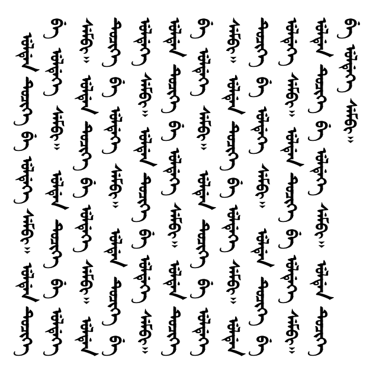
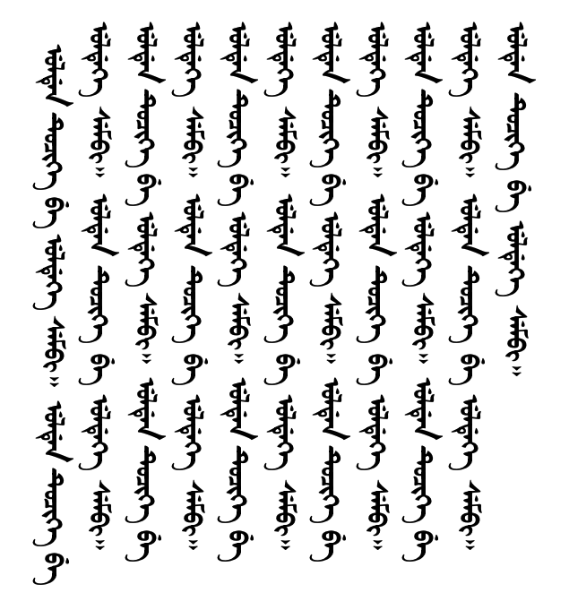
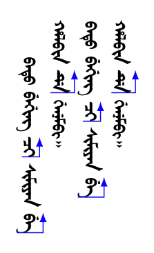
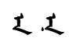
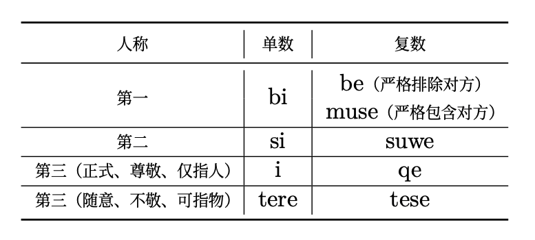
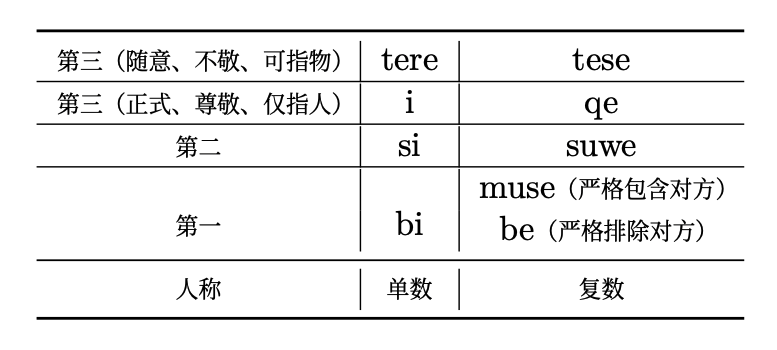
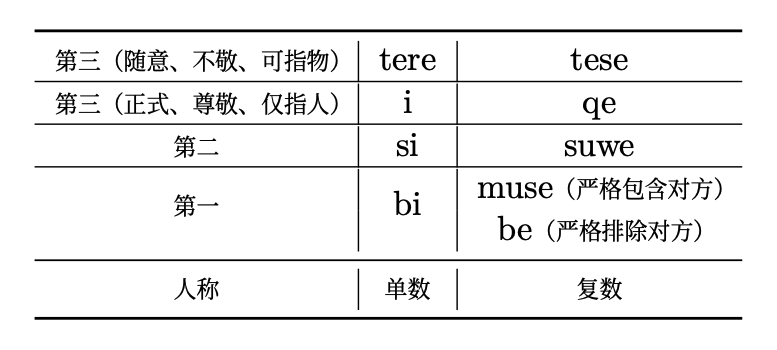
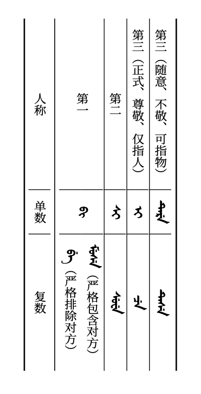
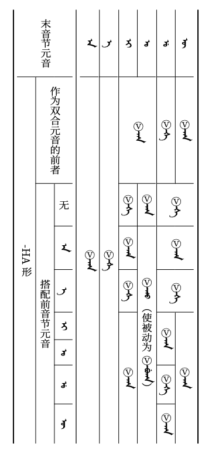

# LaTeX排版满文笔记的尝试：四、细节补充

这是尝试用LaTeX排版满文笔记的第四篇文章。通过前三篇文章，我们已经可以排版出样式较为丰富的满文笔记了。这篇文章再补充更多细节，希望可以帮助大家少走弯路。

## 更多细节

### 格助词的不换行处理

满文中规定，格助词不能置于一行的行首。考虑以下文本：

```tex
\begin{document}
ulden tuqike be uldeke sembi. ulden tuqike be uldeke sembi. ulden tuqike be uldeke sembi. ulden tuqike be uldeke sembi. ulden tuqike be uldeke sembi. ulden tuqike be uldeke sembi. ulden tuqike be uldeke sembi. ulden tuqike be uldeke sembi. ulden tuqike be uldeke sembi. ulden tuqike be uldeke sembi. ulden tuqike be uldeke sembi. ulden tuqike be uldeke sembi. ulden tuqike be uldeke sembi. ulden tuqike be uldeke sembi. ulden tuqike be uldeke sembi. ulden tuqike be uldeke sembi.
\end{document}
```



像这样ᠪᡝ出现在行首的情况是**错误的**，是需要我们避免的。

LaTeX本身具有“假空格”功能，即字符`~`。所谓假空格，就是指该位置虽然渲染为空格，但并不参与换行计算。在录入满文时，养成在格助词前使用假空格的习惯，可以为我们免除很多手动调整的麻烦：

```tex
\begin{document}
ulden tuqike~be uldeke sembi. ulden tuqike~be uldeke sembi. ulden tuqike~be uldeke sembi. ulden tuqike~be uldeke sembi. ulden tuqike~be uldeke sembi. ulden tuqike~be uldeke sembi. ulden tuqike~be uldeke sembi. ulden tuqike~be uldeke sembi. ulden tuqike~be uldeke sembi. ulden tuqike~be uldeke sembi. ulden tuqike~be uldeke sembi. ulden tuqike~be uldeke sembi. ulden tuqike~be uldeke sembi. ulden tuqike~be uldeke sembi. ulden tuqike~be uldeke sembi. ulden tuqike~be uldeke sembi.
\end{document}
```

在这里，LaTeX就会将tuqike和be看作一个单词来计算换行位置，不会在二者中间换行。



### 首行不缩进

可以在段落之前使用`\noindent`指令来取消当前段落首行的缩进，使段首与普通回行平齐。例如

```tex
\begin{document}
batu beging \arrowuline{qi} simiyan \arrowuline{be} \\
halbin \arrowuline{de} genembi.

\noindent batu beging \arrowuline{qi} simiyan \arrowuline{be} \\
halbin \arrowuline{de} genembi.
\end{document}
```



### en的点

太清字体不会自动识别en的点，而对应的解决办法是，在字符ᠨ（U+1828）后紧跟字符U+180B来强行显示点。我们可以在abkai-to-manju.map文件中为其单独分配映射方式。这里将字符组合`n'`映射为U+1828 U+180B：

```
; n强制显示点，用于en
U+006E U+0027 <> U+1828 U+180B ; n'
```

这样，源代码中可以以`en'`的形式来正确显示en：

```tex
\begin{document}
en

en'
\end{document}
```



在复制粘贴转写时，需要格外留意这个规则，并手动添加或删除`'`。

### 跨行表格的错位问题

在实际使用中，我们发现，`\XeTeXupwardsmode1`的设置会使得表格中使用`\multirow`设置的跨行单元格（旋转后体现为跨列）出现错位问题。

例如，考虑如下表格：

```tex
\usepackage{multirow}
\usepackage{booktabs}

\begin{document}
\begin{center}
    \begin{tabular}{c|c|c}
        \toprule
        人称 & 单数 & 复数\\
        \midrule
        \multirow{2}{*}{第一} & \multirow{2}{*}{bi} & be（严格排除对方）\\
            &   &   muse（严格包含对方）\\
        \hline
        第二 & si & suwe\\
        \hline
        第三（正式、尊敬、仅指人） & i & qe\\
        \hline
        第三（随意、不敬、可指物） & tere & tese\\
        \bottomrule
    \end{tabular}
\end{center}
\end{document}
```

我们暂时不映射字体，以免在表述中混淆表格的行和列。在未映射字体的横排模式下，该表格可以正确显示为如下效果：


请注意使用`\multirow`合并的“第一”“bi”单元格，均可正确显示。但在设置`\XeTeXupwardsmode1`后，表格显示效果如下：



可以看到，“第一”“bi”两格的文字摆放位置偏下。目前的解决办法是，在为`\multirow`传入第一个参数时，实际传入比跨行数量大1的值。例如，将上表的`\multirow{2}{*}{...}`改为`\multirow{3}{*}{...}`，则显示效果相对正常：



映射字体并将输出旋转后的显示效果如下：



使用`\multicolumn`实现的跨列合并则没有类似的问题。

该问题的具体机制不太清楚，但解决方案同样适用于跨更多行的情况。这里给出另一个更复杂的表格供参考：

```tex
\xeCJKsetcharclass{"24B6}{"24F9}{1}%Ⓐ~ⓩ
\newcommand{\V}{ Ⓥ\hspace{-0.5pt}\ignorespaces}

\begin{document}
\begin{center}
  \begin{tabular}{c|c|c|c|c|c|c|c|c}
  \toprule
  \multirow{4}{*}{末音节元音} & \multicolumn{8}{c}{\lat{-HA形}} \\
  \cline{2-9} 
  & \multirow{3}{*}{作为双合元音的前者} & \multicolumn{7}{c}{搭配前音节元音} \\ 
  \cline{3-9} 
  & & 无 & a & e & i & o & u & v \\\midrule
  a & \multicolumn{8}{c}{\V =ha} \\\hline
  e & \multicolumn{8}{c}{\V =he} \\\hline
  i & \multirow{3}{*}{\V =ha} & \V =he & \V =ha & \V =he & \multicolumn{4}{c}{\V =ha} \\\cline{1-1} \cline{3-9}
  o & & \V =ha & \multicolumn{6}{c}{\V =ho （使被动为\V =buha）} \\\hline
  u & \V =he & \multirow{3}{*}{\V =he} & \multirow{3}{*}{\V =ha} & \multirow{3}{*}{\V =he} & \multicolumn{2}{c|}{\V =ha} & \V =he & \V =ha \\\cline{1-2}
  \cline{6-9}
  v & \V =ha & & & & \multicolumn{4}{c}{\V =ha} \\\bottomrule
  \end{tabular}
\end{center}
\end{document}
```



作为拓展，这里定义了Ⓥ作为动词词干的表示。这里有两个需要注意的内容：

- 需要通过`\xeCJKsetcharclass`让XeCJK认为Ⓥ是一个汉字（这里将大写的Ⓐ~小写的ⓩ都直接纳入了），这样才能将其按汉字的竖排规则偏移，避免与下面接续的后缀偏移；
- Ⓥ后需要手动减小空格宽度，并且通过`\ignorespaces`避免重复计算空格，使得其能够跟后缀接触。

具体的类似内容，就留给进阶读者探索了。

## 未来展望

### 更多字体的适配

在写这几篇分享文章的时候，我突然意识到，既然只要字体对字符的支持覆盖全部满文字符，就可以通过调整映射文件来让其转写过程符合我们的习惯。例如，对于无法自动将元音后的᠊ᡠ显示为᠊ᠣ的情况，可以通过重新定义`au`、`eu`、`iu`、`ou`、`uu`、`vu`的映射来解决，即针对字体，在map文件中单独定义以下映射：

```
; u结尾的二合元音改写为o
U+0061 U+0075 <> U+1820 U+1823 ; au
U+0065 U+0075 <> U+185D U+1823 ; eu
U+0069 U+0075 <> U+1873 U+1823 ; iu
U+006F U+0075 <> U+1823 U+1823 ; ou
U+0075 U+0075 <> U+1860 U+1823 ; uu
U+0076 U+0075 <> U+1861 U+1823 ; vu
```

可以看到，二合元音结尾的`u`实际被映射到字母ᠣ而非ᡠ上。

也就是说，只要整理出足够完整的映射文件，即使字体本身不支持各种复杂情况的自动适配，也能借助LaTeX通过直观的转写来正确排版。对于map文件的编写，甚至可以借助JSON等格式通过配置工具自动完成。这样可以极大方便不同系统、不同标准满文字体的混排。

### 新字体的预告

在进行LaTeX排版满文时，我感觉到满文字体的变形规则复杂多变，字体设计师往往自行处理其中的嵌套关系，这对于设计映射规则很有难度。

正如之前剧透过的，我正在自主设计一款满文字体：满圆体（Modern manJu Round）。这款字体考虑将内部的变形逻辑公开，连带map文件一同发布。欢迎各位监工。


## 拓展参考

以下是一些参考和学习资源，分享给大家。

- 文中提到的满文学习笔记（这几篇混排文章也会在后续并入该库）：https://github.com/ErSanSan233/latex-manju-note
  - 这个笔记记的是这套课程：https://www.bilibili.com/video/BV1px411C7rs

- 满圆体：https://github.com/ErSanSan233/modern-manju-round

- 可以自定义键位，从而打出各种文字和符号的输入法——Keyman：https://keyman.com

- 一个介绍并提供满文字体和Keyman满文键位下载的网站：https://www.manchustudiesgroup.org/typing-manchu/

