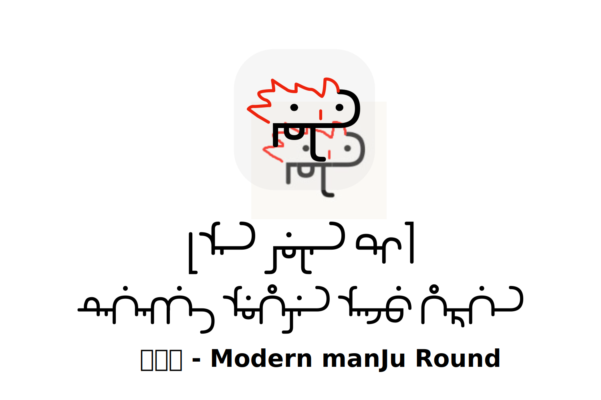

# 满圆体内测发布：属于每个人的开源满文美术字

在学习满文的过程中，我总是苦于字体的稀少和单调。究其原因，我认为是满文字母的变形规则复杂，让想制作字体但字体变体规则知识有限的朋友们一头雾水。

因此，我制作了满圆体，并将其变体规则开源出来。

满圆体尽量减少了字形的数量，其字形表如下：

大家只需要根据满圆体的思路，将这些字形替换掉，即可生成属于自己的满文效果。

我为满圆体配了详尽的文档来解释其中的设计思路。如果想进一步挖掘满圆体的特性、改造变体规则，这些文档可以帮助你快速了解满圆体设计的每个细节。

目前满圆体还处于开发阶段，可能存在规则错误和字符缺失的问题。请大家在发现问题后反馈给我。

满圆体的使用遵循SIL Open Font License 1.1。对于满足协议要求的使用用途，大家不必找我授权。

祝探索愉快！

GitHub：https://github.com/ErSanSan233/modern-manju-round